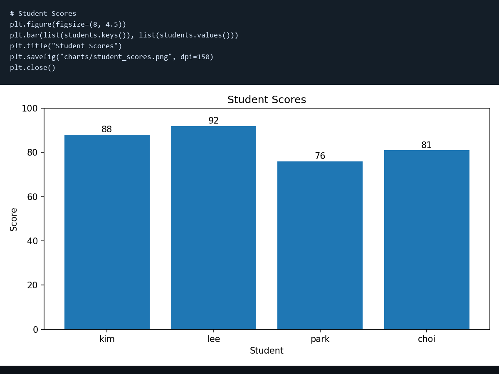
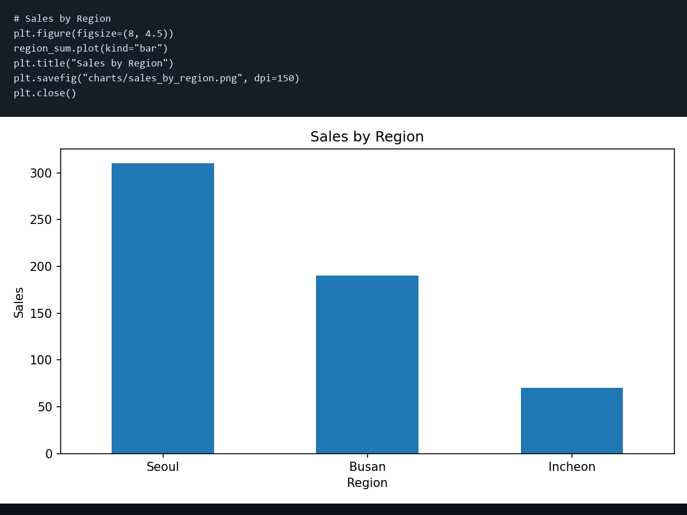
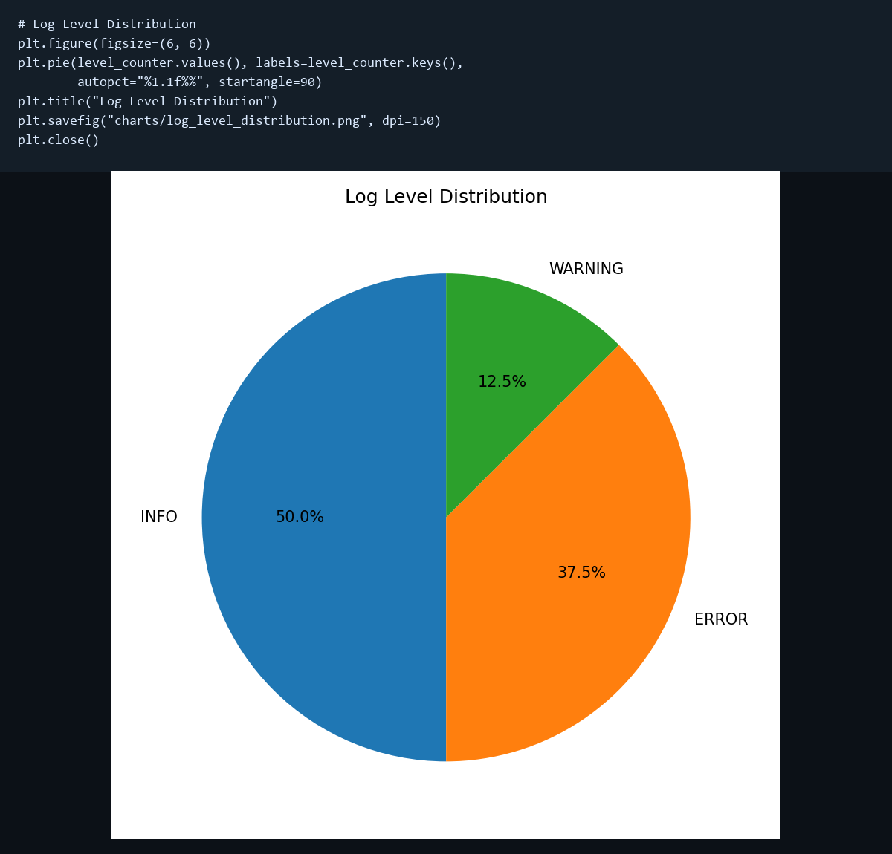
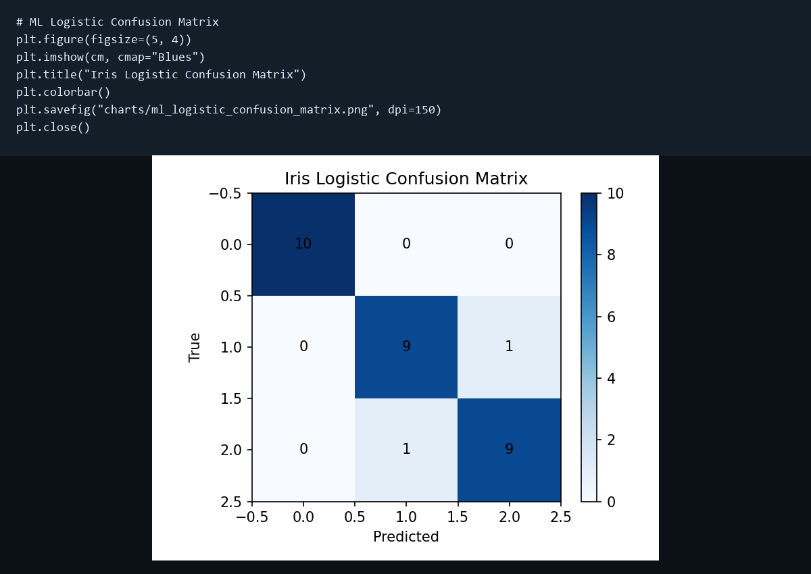
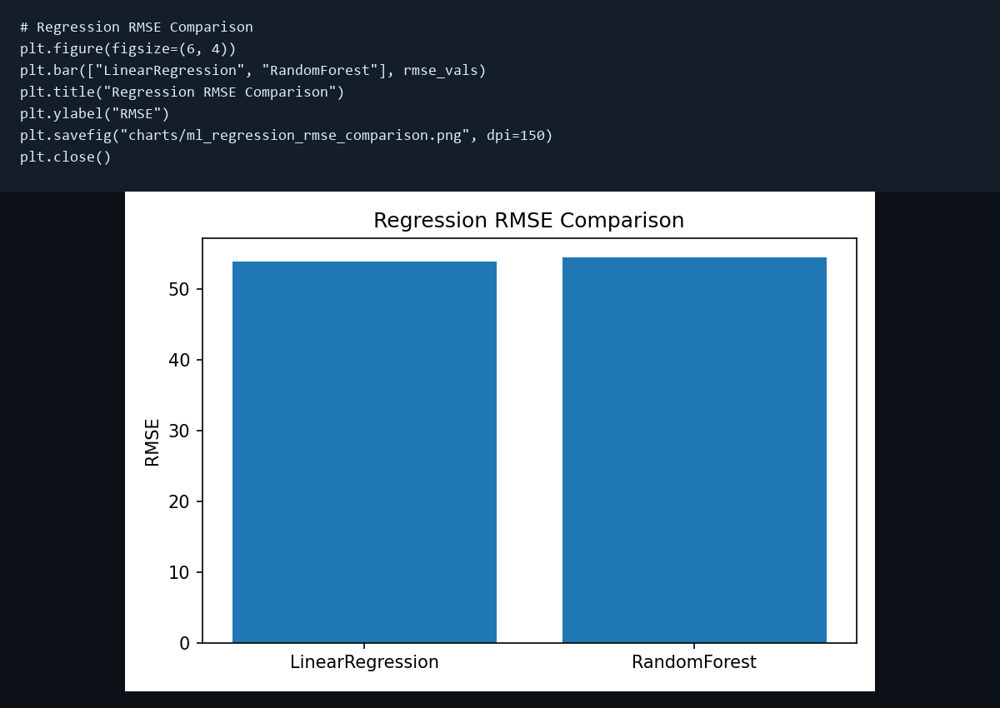
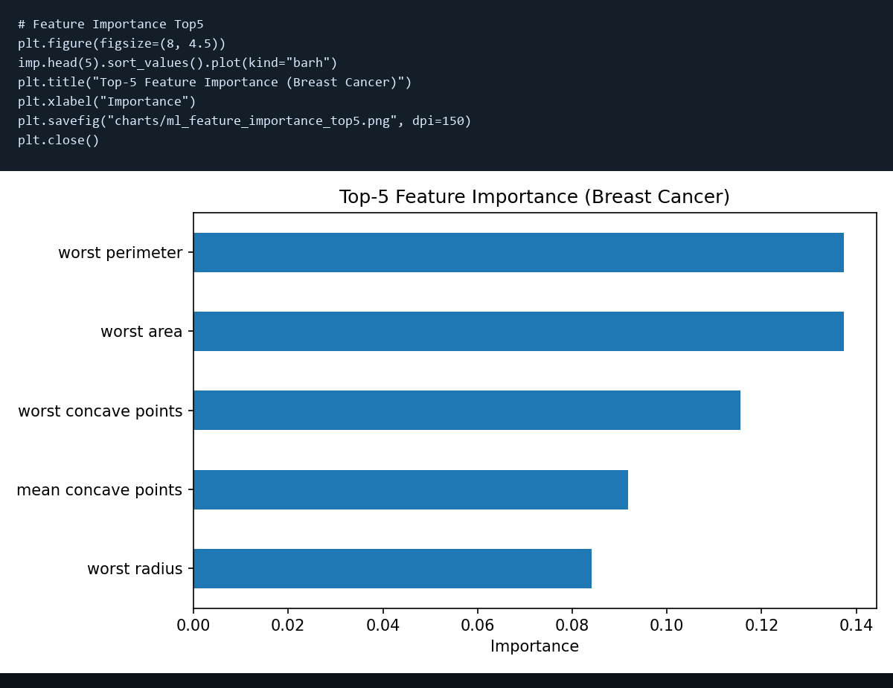
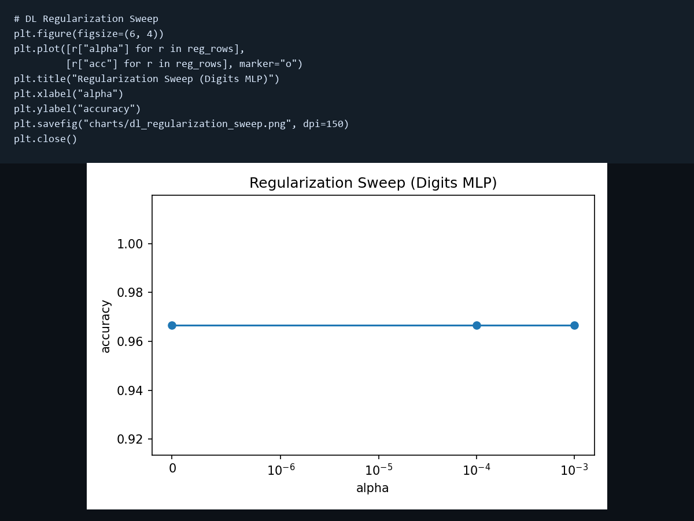

# python-study

파이썬 + 머신러닝/딥러닝 예제를 실행하고, 결과를 **시각화 PNG**로 저장하는 프로젝트입니다.

## 실행

```powershell
python run_python_programming.py
python run_all_ml_dl_examples.py
```

인터프리터 충돌 시:

```powershell
& "C:\Users\user\AppData\Local\Programs\Python\Python310\python.exe" run_python_programming.py
& "C:\Users\user\AppData\Local\Programs\Python\Python310\python.exe" run_all_ml_dl_examples.py
```

## 시각화가 어떻게 만들어지나?

각 스크립트는 `matplotlib`로 그래프를 그리고 `charts/`에 저장합니다.

예시 코드:

```python
plt.figure(figsize=(8, 4.5))
region_sum.plot(kind="bar")
plt.title("Sales by Region")
plt.tight_layout()
plt.savefig("charts/sales_by_region.png", dpi=150)
plt.close()
```

## 주요 코드 스니펫

### 1) Python 실습 스크립트 (`run_python_programming.py`)

```python
# 지역별 매출 집계
sales_df = pd.DataFrame(
    {
        "region": ["Seoul", "Seoul", "Busan", "Busan", "Incheon", "Seoul"],
        "product": ["A", "B", "A", "C", "A", "C"],
        "amount": [120, 80, 100, 90, 70, 110],
    }
)
region_sum = sales_df.groupby("region")["amount"].sum().sort_values(ascending=False)

# 시각화 저장
plt.figure(figsize=(8, 4.5))
region_sum.plot(kind="bar")
plt.title("Sales by Region")
plt.savefig("charts/sales_by_region.png", dpi=150)
plt.close()
```

### 2) ML/DL 스크립트 (`run_all_ml_dl_examples.py`)

```python
# Logistic Regression 학습/평가
X, y = load_iris(return_X_y=True)
X_train, X_test, y_train, y_test = train_test_split(
    X, y, test_size=0.2, random_state=42, stratify=y
)

scaler = StandardScaler()
X_train_s = scaler.fit_transform(X_train)
X_test_s = scaler.transform(X_test)

clf = LogisticRegression(max_iter=1000, random_state=42)
clf.fit(X_train_s, y_train)
pred = clf.predict(X_test_s)
cm = confusion_matrix(y_test, pred)

# Confusion Matrix 저장
plt.figure(figsize=(5, 4))
plt.imshow(cm, cmap="Blues")
plt.title("Iris Logistic Confusion Matrix")
plt.savefig("charts/ml_logistic_confusion_matrix.png", dpi=150)
plt.close()
```

### 3) 추가 코드 스니펫 (`run_python_programming.py`)

```python
# 로그 레벨 집계
logs = [
    "INFO login user=kim",
    "ERROR db timeout",
    "INFO view page=home",
    "WARNING cpu high",
    "ERROR db timeout",
    "INFO logout user=kim",
    "ERROR api 500",
    "INFO login user=lee",
]

level_counter = Counter(line.split()[0] for line in logs)

plt.figure(figsize=(6, 6))
plt.pie(level_counter.values(), labels=level_counter.keys(), autopct="%1.1f%%", startangle=90)
plt.title("Log Level Distribution")
plt.savefig("charts/log_level_distribution.png", dpi=150)
plt.close()
```

### 4) 추가 코드 스니펫 (`run_all_ml_dl_examples.py`)

```python
# Feature importance 상위 5개
bc = load_breast_cancer()
Xb = pd.DataFrame(bc.data, columns=bc.feature_names)
yb = bc.target

rf_cls = RandomForestClassifier(n_estimators=300, random_state=42, n_jobs=-1)
rf_cls.fit(Xb, yb)
imp = pd.Series(rf_cls.feature_importances_, index=Xb.columns).sort_values(ascending=False)

plt.figure(figsize=(8, 4.5))
imp.head(5).sort_values().plot(kind="barh")
plt.title("Top-5 Feature Importance (Breast Cancer)")
plt.xlabel("Importance")
plt.savefig("charts/ml_feature_importance_top5.png", dpi=150)
plt.close()
```

## 생성되는 시각화 파일

- `charts/student_scores.png`
- `charts/sales_by_region.png`
- `charts/log_level_distribution.png`
- `charts/ml_logistic_confusion_matrix.png`
- `charts/ml_regression_rmse_comparison.png`
- `charts/ml_feature_importance_top5.png`
- `charts/dl_regularization_sweep.png`

## 결과 JSON

- `python-outputs/python_results.json`
- `outputs/all_examples_results.json`

## 시각화 스크린샷 (이미지 안에 코드 포함)

### 1) Student Scores


### 2) Sales by Region


### 3) Log Level Distribution


### 4) ML Logistic Confusion Matrix


### 5) Regression RMSE Comparison


### 6) Feature Importance Top5


### 7) DL Regularization Sweep

