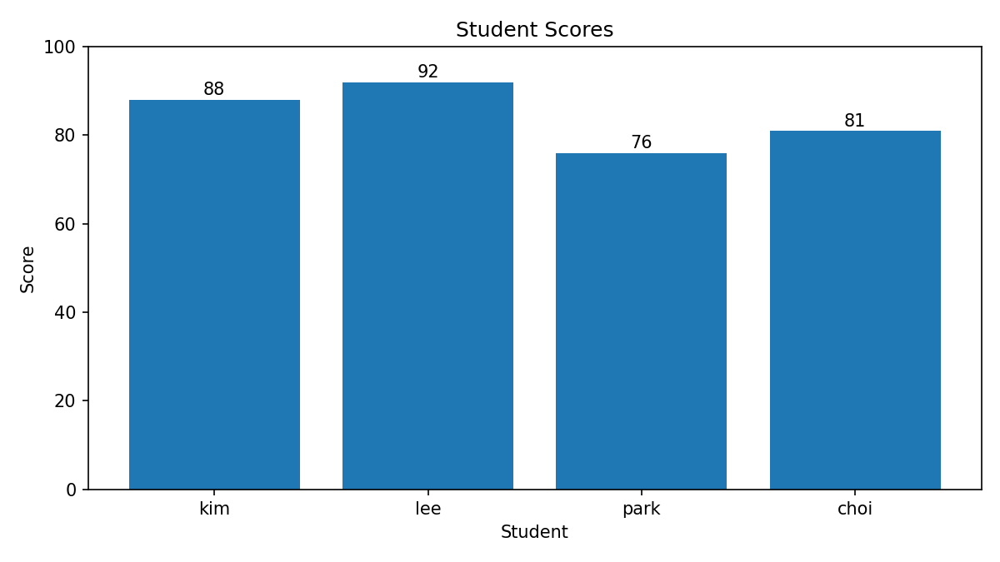
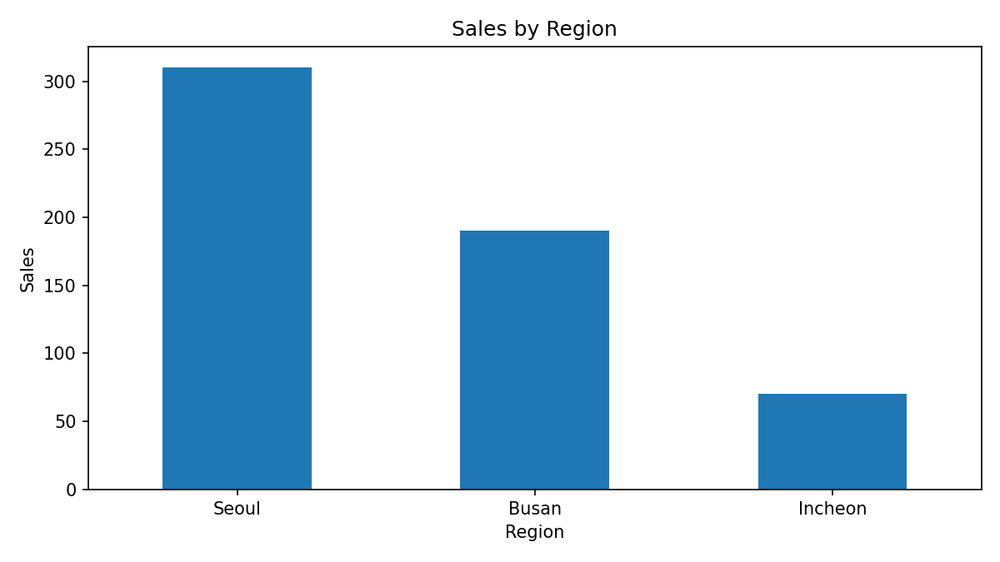
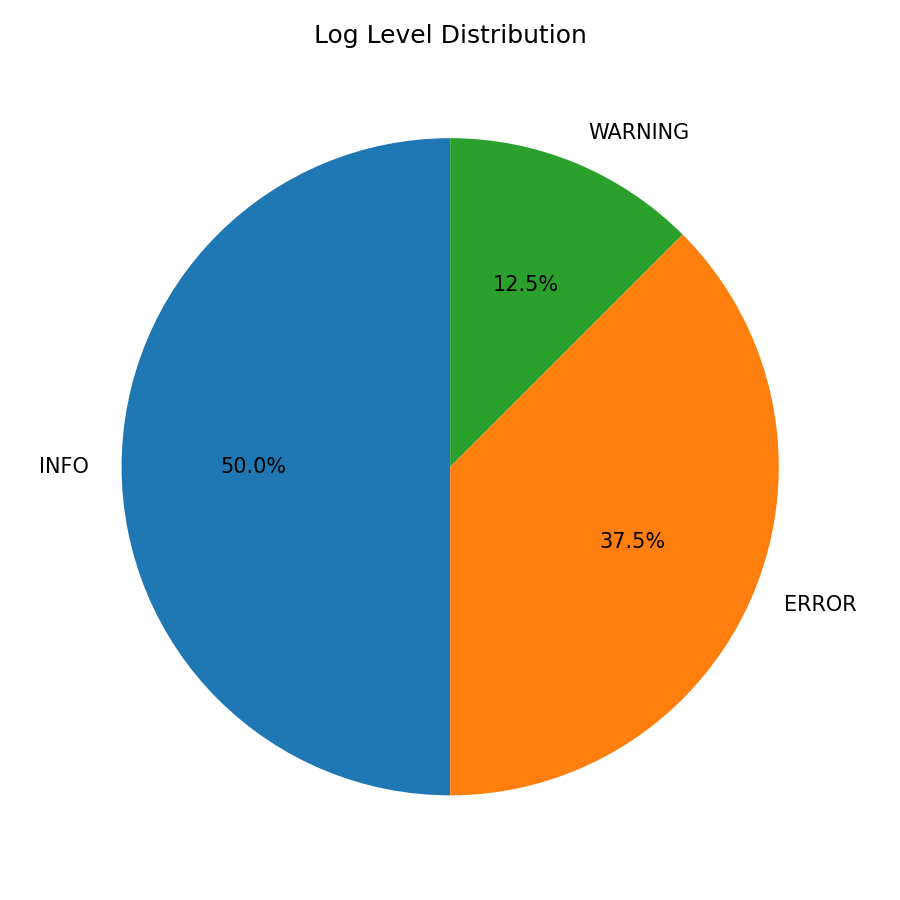
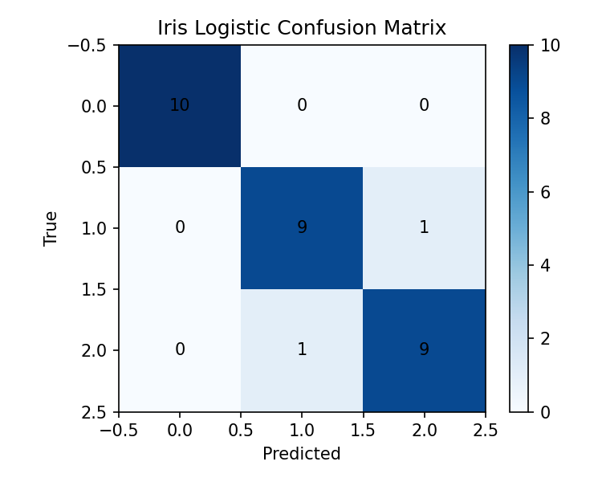
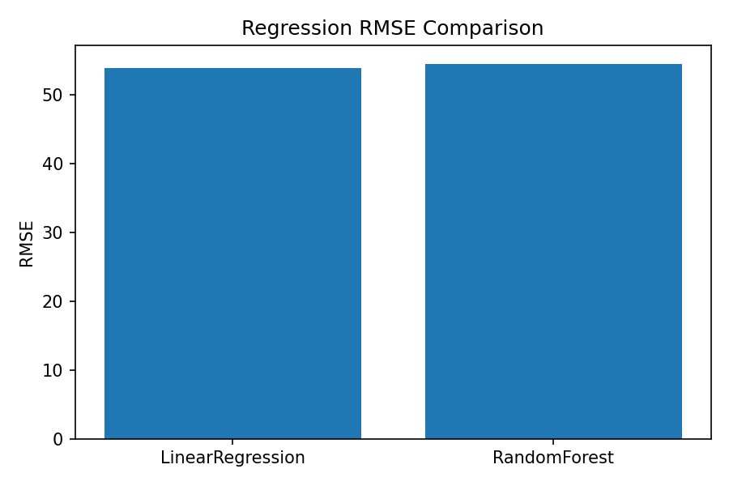
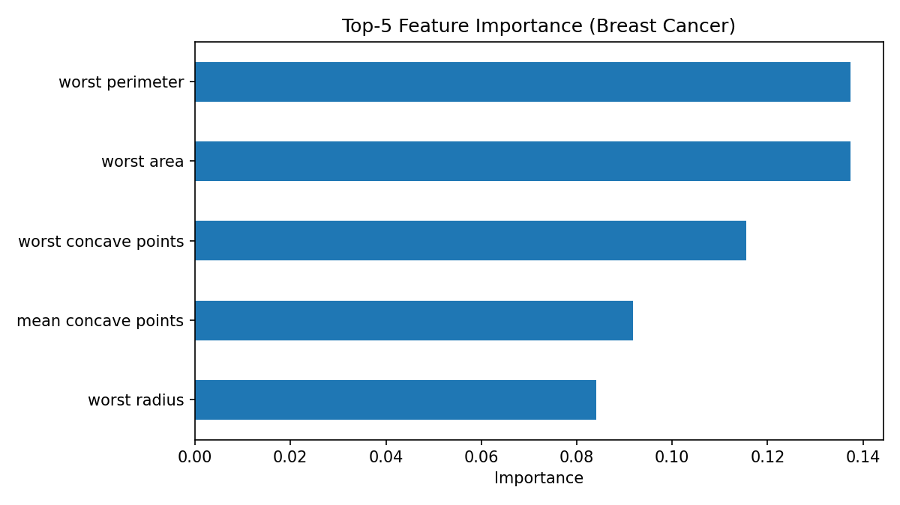
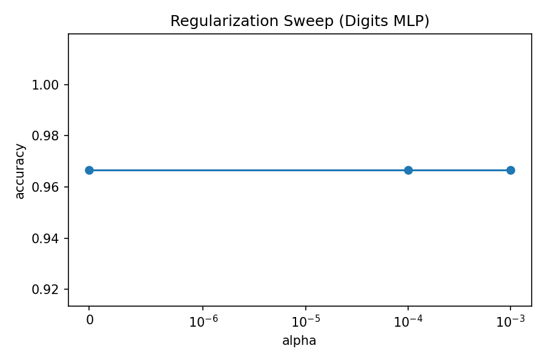

# python-study

파이썬 + 머신러닝/딥러닝 예제를 실행하고, 결과를 **시각화 PNG**로 저장하는 프로젝트입니다.

## 실행

```powershell
python run_python_programming.py
python run_all_ml_dl_examples.py
```

인터프리터 충돌 시:

```powershell
& "C:\Users\user\AppData\Local\Programs\Python\Python310\python.exe" run_python_programming.py
& "C:\Users\user\AppData\Local\Programs\Python\Python310\python.exe" run_all_ml_dl_examples.py
```

## 시각화가 어떻게 만들어지나?

각 스크립트는 `matplotlib`로 그래프를 그리고 `charts/`에 저장합니다.

예시 코드:

```python
plt.figure(figsize=(8, 4.5))
region_sum.plot(kind="bar")
plt.title("Sales by Region")
plt.tight_layout()
plt.savefig("charts/sales_by_region.png", dpi=150)
plt.close()
```

## 생성되는 시각화 파일

- `charts/student_scores.png`
- `charts/sales_by_region.png`
- `charts/log_level_distribution.png`
- `charts/ml_logistic_confusion_matrix.png`
- `charts/ml_regression_rmse_comparison.png`
- `charts/ml_feature_importance_top5.png`
- `charts/dl_regularization_sweep.png`

## 결과 JSON

- `python-outputs/python_results.json`
- `outputs/all_examples_results.json`

## 시각화 스크린샷

### Student Scores


### Sales by Region


### Log Level Distribution


### ML Logistic Confusion Matrix


### Regression RMSE Comparison


### Feature Importance Top5


### DL Regularization Sweep

